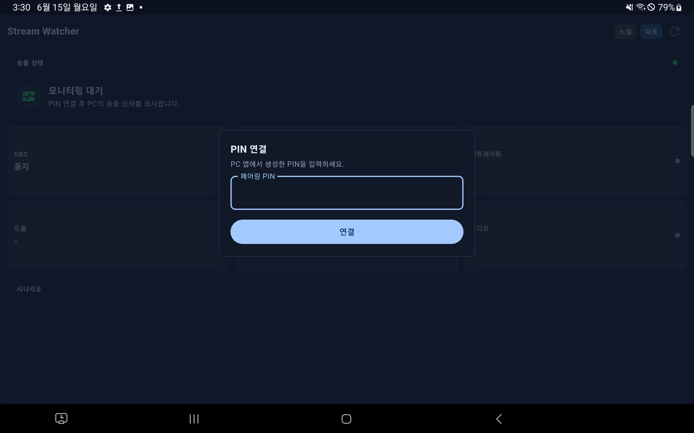
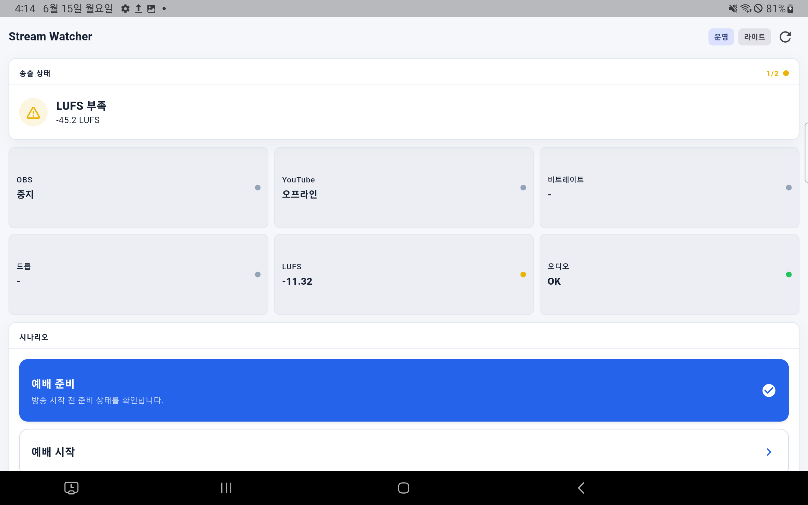
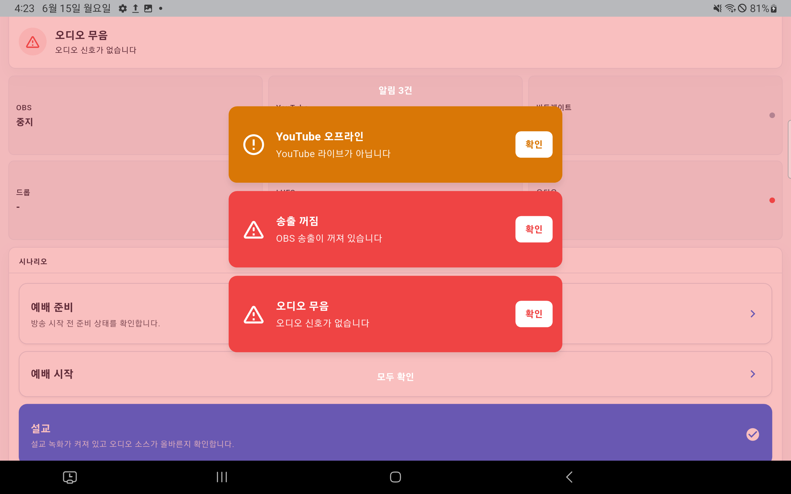

# Stream Watcher 태블릿 사용 매뉴얼

PC 프로그램 Stream Capture를 모바일로 모니터링하고, 시나리오를 리모트 컨트롤할 수 있습니다.

## 1. 준비하기

사용 전에 아래 항목을 확인하세요.

- PC에서 Stream Capture를 실행합니다.
- 태블릿과 PC를 같은 Wi-Fi 또는 같은 로컬 네트워크에 연결합니다.
- PC 앱에서 태블릿 연결용 PIN을 생성합니다.
- 태블릿에서 `STREAM Watcher` 앱을 실행합니다.

## 2. PIN으로 연결하기

태블릿 앱을 처음 실행하면 PIN 연결 화면이 표시됩니다.

1. PC 앱에서 표시된 PIN을 확인합니다.
2. 태블릿의 `페어링 PIN` 입력칸에 PIN을 입력합니다.
3. `연결` 버튼을 누릅니다.
4. 연결이 완료되면 대시보드 화면으로 이동합니다.

연결이 되지 않으면 PC와 태블릿이 같은 Wi-Fi에 있는지, PC의 Stream Capture가 실행 중인지 확인하세요.

## 3. 대시보드 확인하기

연결 후에는 방송 상태 대시보드가 표시됩니다.

대시보드에서 확인할 수 있는 주요 항목은 다음과 같습니다.

- `송출 상태`: 현재 방송 모니터링의 전체 상태입니다.
- `OBS`: OBS가 송출 중인지 확인합니다.
- `YouTube`: YouTube 라이브 감지 또는 연결 상태를 확인합니다.
- `비트레이트`: 현재 송출 비트레이트를 확인합니다.
- `드롭`: 드롭 프레임 수 또는 비율을 확인합니다.
- `LUFS`: 오디오 라우드니스 상태를 확인합니다.
- `오디오`: 오디오 입력 또는 송출 상태를 확인합니다.
- `시나리오`: 방송 진행 단계별 체크 항목을 확인합니다.

상단의 새로고침 아이콘을 누르면 현재 상태를 다시 불러옵니다.

## 4. 일반 모드와 운영 모드

상단의 `노멀` / `운영` 버튼으로 모드를 선택합니다.

- `노멀`: 상태 확인 전용 모드입니다. 시나리오 단계 변경이 잠겨 있습니다.
- `운영`: 방송 진행 중 태블릿에서 시나리오 단계를 직접 변경할 수 있습니다.

방송 중 실수 조작을 줄이려면 평소에는 `노멀` 모드를 사용하고, 단계 변경이 필요할 때만 `운영` 모드로 전환하세요.

## 5. 시나리오 단계 변경하기

운영 모드에서는 시나리오 목록에서 원하는 단계를 눌러 현재 방송 단계를 변경할 수 있습니다.

1. 상단에서 `운영` 모드를 선택합니다.
2. `시나리오` 영역에서 이동할 단계를 누릅니다.
3. 선택된 단계는 파란색으로 강조됩니다.

노멀 모드에서는 시나리오 버튼이 잠금 상태로 표시되며 단계 변경이 되지 않습니다.

## 6. 알림 확인하기

방송 상태에 문제가 생기면 화면 전체가 강조되고 알림 카드가 표시됩니다.

알림이 표시되면 다음 순서로 대응하세요.

1. 알림 제목과 메시지를 확인합니다.
2. PC 또는 방송 장비 상태를 점검합니다.
3. 태블릿의 `확인` 버튼을 눌러 진동과 팝업 알림을 멈춥니다.
4. 문제가 해결되었는지 대시보드의 상태 값을 다시 확인합니다.

여러 알림이 동시에 표시될 경우 `모두 확인`으로 한 번에 확인할 수 있습니다.

## 7. 알림 이벤트 로그 확인하기

대시보드 하단으로 스크롤하면 `알림 이벤트` 영역이 표시됩니다.

`알림 이벤트`는 최근 발생한 알림 기록을 보여주는 영역입니다. 이미 확인한 알림도 로그에 남기 때문에, 방송 중 어떤 문제가 있었는지 나중에 다시 확인할 수 있습니다.

확인할 수 있는 내용은 다음과 같습니다.

- 최근 발생한 알림 제목
- 알림 메시지 또는 상태
- 사용자가 확인한 알림의 `확인됨` 표시

방송 중 알림 팝업을 놓쳤거나, 문제 조치 후 어떤 알림이 먼저 발생했는지 확인해야 할 때 이 영역을 확인하세요.

## 8. 테마 전환

상단의 `다크` / `라이트` 버튼으로 화면 테마를 전환합니다.

## 9. 연결 문제 해결

PIN 연결이 실패하거나 상태가 갱신되지 않을 때는 아래 순서로 확인하세요.

1. PC의 Stream Capture가 실행 중인지 확인합니다.
2. 태블릿과 PC가 같은 Wi-Fi에 연결되어 있는지 확인합니다.
3. VPN, 게스트 Wi-Fi, 방화벽이 로컬 네트워크 통신을 막고 있지 않은지 확인합니다.
4. PC 앱에서 새 PIN을 생성한 뒤 다시 연결합니다.
5. 태블릿 앱을 완전히 종료한 뒤 다시 실행합니다.

## 10. 권장 사용 흐름

방송 시작 전:

1. PC에서 Stream Capture를 실행합니다.
2. 태블릿 앱을 열고 PIN으로 연결합니다.
3. OBS, YouTube, 비트레이트, 오디오 상태를 확인합니다.
4. 필요하면 `운영` 모드로 전환해 시나리오 단계를 맞춥니다.

방송 중:

1. 태블릿을 보이는 위치에 두고 대시보드를 확인합니다.
2. 알림이 뜨면 내용을 확인하고 원인을 조치합니다.
3. 알림 카드의 `확인`을 눌러 진동을 멈춥니다.
4. 단계 변경이 필요할 때만 `운영` 모드로 전환합니다.

방송 종료 후:

1. 마지막 상태를 확인합니다.
2. 필요하면 PC 앱에서 태블릿 연결을 해제합니다.
3. 다음 방송을 위해 태블릿 충전 상태를 확인합니다.
